# Graphics Reference — Realm of Shadow

All tiles are displayed at the in-game scale of 32×32 pixels. This document covers tiles in `src/assets/game/` (active in the game) and `src/assets/unassigned/` (available for future use). Archived original source art is in `src/assets/archive/` and is not listed here.

---

## 1. Overworld Terrain

These tiles render the outdoor world map. Defined in `data/tile_manifest.json` under `"overworld"`, loaded by `TileManifest` and rendered in `renderer.py :: _u3_draw_overworld_tile()`.

| Preview | Name | Tile ID | File | Used For |
|---------|------|---------|------|----------|
|  | grass | 0 | `game/terrain/grass.png` | Default overworld ground; also used as town floor (tile_id 10) |
|  | water | 1 | `game/terrain/water.png` | Oceans, rivers, lakes |
|  | forest | 2 | `game/terrain/forest.png` | Forest terrain; blocks movement |
|  | mountain | 3 | `game/terrain/mountain.png` | Mountain terrain; impassable |
| 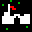 | town | 4 | `game/terrain/town.png` | Town entrance markers on overworld; also used as town exit (tile_id 14) |
| 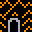 | dungeon | 5 | `game/terrain/dungeon.png` | Dungeon entrance markers; shared by dungeon_cleared (tile_id 9) |
|  | path | 6 | `game/terrain/path.png` | Dirt paths connecting landmarks |
| 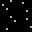 | sand | 7 | `game/terrain/sand.png` | Sandy/beach terrain near coasts |
| 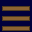 | bridge | 8 | `game/terrain/bridge.png` | Wooden bridge over rivers |

---

## 2. Town Interior Tiles

Used inside town maps. Defined in `data/tile_manifest.json` under `"town"`, rendered in `renderer.py :: _u3_draw_town_tile()`. Tiles not matched here fall through to procedural rendering.

| Preview | Name | Tile ID | File | Used For |
|---------|------|---------|------|----------|
|  | floor | 10 | `game/terrain/grass.png` | Indoor floor (shares grass sprite) |
|  | wall | 11 | `game/terrain/wall.png` | Building walls |
| 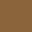 | counter | 12 | `game/terrain/counter.png` | Shop counters |
| 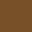 | door | 13 | `game/terrain/door.png` | Doorways |
|  | exit | 14 | `game/terrain/town.png` | Town exit tile (shares town sprite) |
| 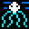 | altar | 35 | `game/terrain/altar.png` | Altars in temples/shrines |

---

## 3. Dungeon Tiles

Base sprites for dungeon levels. Defined in `data/tile_manifest.json` under `"dungeon"`. These are blitted first, then procedural effects (palette tinting, moss, lava overlays) are drawn on top in `renderer.py :: _u3_draw_dungeon_tile()`.

| Preview | Name | Tile ID | File | Used For |
|---------|------|---------|------|----------|
| 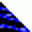 | dfloor | 20 | `game/dungeon/brick_floor.png` | Dungeon floor; also used as base for stairs (22), trap (24), stairs_down (25), machine (30), keyslot (31) |
|  | dwall | 21 | `game/dungeon/brick_wall.png` | Dungeon walls |
|  | chest | 23 | `game/dungeon/chest_tile.png` | Treasure chests in dungeons |
| 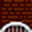 | ddoor / locked_door | 26, 29 | `game/dungeon/locked_door.png` | Dungeon doors (locked and unlocked) |
| 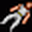 | artifact | 27 | `game/dungeon/sparkle.png` | Artifact pickup locations |
|  | portal | 28 | `game/dungeon/portal_open.png` | Active dungeon portals |
| 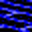 | puddle | 32 | `game/dungeon/shallow_water.png` | Water puddles in dungeons |
| 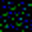 | moss | 33 | `game/dungeon/swamp.png` | Mossy/swampy dungeon patches |
| 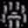 | wall_torch | 34 | `game/dungeon/torch_post.png` | Wall-mounted torches |

---

## 4. Player Characters

Class sprites for the party. Defined in `data/tile_manifest.json` under `"characters"` and `data/character_tiles.json`. Loaded by `renderer.py :: _load_class_sprites()` and used on the overworld party display, combat, party screen, and character creation.

| Preview | Name | File | Used For |
|---------|------|------|----------|
|  | fighter | `game/characters/fighter.png` | Fighter class; default party member Roland |
| 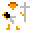 | cleric | `game/characters/cleric.png` | Cleric class; default party member Selina |
| 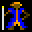 | wizard | `game/characters/wizard.png` | Wizard class; default party member Elrond |
| 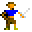 | thief | `game/characters/thief.png` | Thief class; default party member Merry |
| 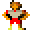 | barbarian | `game/characters/barbarian.png` | Barbarian class |
| 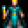 | alchemist | `game/characters/alchemist.png` | Alchemist class |
| 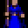 | illusionist | `game/characters/illusionist.png` | Illusionist class |
| 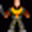 | druid | `game/characters/druid.png` | Druid class; default roster member |
| 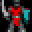 | paladin | `game/characters/paladin.png` | Paladin class; default roster member |
| 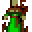 | ranger | `game/characters/ranger.png` | Ranger class; default roster member |
| 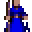 | lark | `game/characters/lark.png` | Lark class |
| 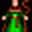 | ranger_alt | `game/characters/ranger_alt.png` | Alternate ranger sprite (character creation) |

---

## 5. NPCs

Non-player character sprites for towns and character creation screens. Loaded from `data/tile_manifest.json` under `"npcs"` and `data/character_tiles.json`. Used by `renderer.py` for town NPC rendering (shopkeep, innkeeper, elder, villagers) and character creation portrait selection.

### Town NPCs (manifest-loaded)

| Preview | Name | File | Used For |
|---------|------|------|----------|
| 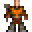 | shopkeep | `game/npcs/shopkeep.png` | Shop merchants |
|  | innkeeper | `game/npcs/innkeeper.png` | Inn proprietors |
| 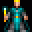 | elder | `game/npcs/elder.png` | Town elders / quest givers |
| 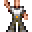 | villager_0 | `game/npcs/villager_citizen.png` | Citizen villager |
|  | villager_1 | `game/npcs/villager_shepherd.png` | Shepherd villager |
| 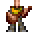 | villager_2 | `game/npcs/villager_bard.png` | Bard villager |
| 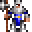 | villager_3 | `game/npcs/villager_guard.png` | Guard villager |
| 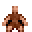 | villager_4 | `game/npcs/villager_beggar.png` | Beggar villager |
| 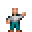 | villager_5 | `game/npcs/villager_child.png` | Child villager |

### Character Creation Portraits (character_tiles.json)

These additional sprites appear as portrait options during character creation. They supplement the class sprites above.

| Preview | File | Used For |
|---------|------|----------|
| 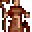 | `game/npcs/u4_monk.png` | Monk portrait option |
| 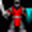 | `game/npcs/u4_tinker.png` | Tinker portrait option |
| 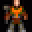 | `game/npcs/u4_shepherd.png` | Shepherd portrait option |
| 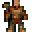 | `game/npcs/u4_avatar.png` | Avatar portrait option |
| 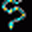 | `game/npcs/u4_knight.png` | Knight portrait option |
| 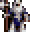 | `game/npcs/u4_guard.png` | Guard portrait option |
| 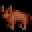 | `game/npcs/u4_healer.png` | Healer portrait option |
| 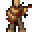 | `game/npcs/u4_jester.png` | Jester portrait option |
| 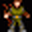 | `game/npcs/u4_villager_male.png` | Male villager portrait |
| 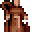 | `game/npcs/u4_villager_female.png` | Female villager portrait |
| 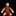 | `game/npcs/u4_child.png` | Child portrait option |
| 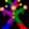 | `game/npcs/u4_beggar.png` | Beggar portrait option |
| 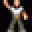 | `game/npcs/u4_citizen.png` | Citizen portrait option |
| 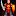 | `game/npcs/u4_guard_npc.png` | Guard NPC portrait option |
| 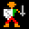 | `game/npcs/townsfolk.png` | Townsfolk portrait option |
| 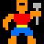 | `game/npcs/brigand.png` | Brigand portrait option |
| 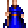 | `game/npcs/vga_avatar.png` | VGA avatar portrait |
|  | `game/npcs/vga_mage.png` | VGA mage portrait |
| 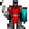 | `game/npcs/vga_fighter.png` | VGA fighter portrait |
| 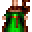 | `game/npcs/vga_druid.png` | VGA druid portrait |
|  | `game/npcs/vga_paladin.png` | VGA paladin portrait |
|  | `game/npcs/vga_ranger.png` | VGA ranger portrait |
|  | `game/npcs/vga_jester.png` | VGA jester portrait |
|  | `game/npcs/vga_rogue.png` | VGA rogue portrait |
|  | `game/npcs/vga_evil_mage.png` | VGA evil mage portrait |

---

## 6. Monsters

Combat enemy sprites. Defined in `data/tile_manifest.json` under `"monsters"` and `data/monsters.json`. Loaded by `TileManifest` and used by `renderer.py :: _load_tile_sheet()` for overworld encounters and combat scenes. The skeleton sprite also serves as the fallback for any missing monster graphic.

| Preview | Name | File | Used By (monsters.json) |
|---------|------|------|------------------------|
|  | giant_rat | `game/monsters/giant_rat.png` | Giant Rat |
|  | skeleton | `game/monsters/skeleton.png` | Skeleton, Skeleton Archer; also global fallback sprite |
|  | orc | `game/monsters/orc.png` | Orc, Orc Shaman |
|  | goblin | `game/monsters/goblin.png` | Goblin |
|  | zombie | `game/monsters/zombie.png` | Zombie |
|  | wolf | `game/monsters/wolf.png` | Wolf |
|  | dark_mage | `game/monsters/dark_mage.png` | Dark Mage; also a character creation portrait |
|  | troll | `game/monsters/troll.png` | Troll |

---

## 7. Overworld Landmarks

Unique one-of-a-kind tiles placed on the overworld map. Defined in `data/unique_tiles.json` and `data/tile_manifest.json` under `"unique_tiles"`. Loaded by `renderer.py :: _get_unique_tile_sprite()`.

| Preview | Name | File | Used For |
|---------|------|------|----------|
|  | moongate_active | `game/landmarks/moongate_active.png` | Active moongate portal; also used for seal_of_binding |
|  | moongate_dormant | `game/landmarks/moongate_dormant.png` | Dormant moongate (inactive stone circle) |
|  | ruined_tower | `game/landmarks/ruined_tower.png` | Crumbling wizard tower ruin |
|  | sunken_shipwreck | `game/landmarks/sunken_shipwreck.png` | Shipwreck near shore |
|  | lava_vent | `game/landmarks/lava_vent.png` | Volcanic steam vent |
|  | smuggler_tunnel | `game/landmarks/smuggler_tunnel.png` | Hidden tunnel entrance |
|  | poison_swamp | `game/landmarks/poison_swamp.png` | Toxic swamp area |
|  | treasure_hoard | `game/landmarks/treasure_hoard.png` | Hidden treasure cache |

---

## 8. Objects

Interactive objects placed on maps. Defined in `data/tile_manifest.json` under `"objects"`.

| Preview | Name | File | Used For |
|---------|------|------|----------|
|  | chest | `game/items/chest.png` | Treasure chests on overworld/towns |
|  | town_gate | `game/items/town_gate.png` | Town entrance gate |

---

## 9. Unassigned Tiles

These 32×32 sprites are not currently used in the game but are available in `src/assets/unassigned/` for future updates. They include alternate animation frames, additional monsters, terrain variants, and utility sprites.

### Characters (alternate frames)

| Preview | File | Description |
|---------|------|-------------|
|  | `unassigned/barbarian_f1.png` | Barbarian frame 1 |
|  | `unassigned/barbarian_f2.png` | Barbarian frame 2 |
|  | `unassigned/cleric_f1.png` | Cleric frame 1 |
|  | `unassigned/cleric_f2.png` | Cleric frame 2 |
|  | `unassigned/fighter_f1.png` | Fighter frame 1 |
|  | `unassigned/fighter_f2.png` | Fighter frame 2 |
|  | `unassigned/illusionist_f1.png` | Illusionist frame 1 |
|  | `unassigned/illusionist_f2.png` | Illusionist frame 2 |
|  | `unassigned/lark_f1.png` | Lark frame 1 |
|  | `unassigned/lark_f2.png` | Lark frame 2 |
|  | `unassigned/paladin_f1.png` | Paladin frame 1 |
|  | `unassigned/paladin_f2.png` | Paladin frame 2 |
|  | `unassigned/thief_f1.png` | Thief frame 1 |
|  | `unassigned/thief_f2.png` | Thief frame 2 |
|  | `unassigned/wizard_f1.png` | Wizard frame 1 |
|  | `unassigned/wizard_f2.png` | Wizard frame 2 |

### Monsters (additional / alternate frames)

| Preview | File | Description |
|---------|------|-------------|
|  | `unassigned/balron_demon_f1.png` | Balron/Demon frame 1 |
|  | `unassigned/balron_demon_f2.png` | Balron/Demon frame 2 |
|  | `unassigned/daemon_f1.png` | Daemon frame 1 |
|  | `unassigned/daemon_f2.png` | Daemon frame 2 |
|  | `unassigned/dragon_f1.png` | Dragon frame 1 |
|  | `unassigned/dragon_f2.png` | Dragon frame 2 |
|  | `unassigned/man_thing_f1.png` | Man-Thing frame 1 |
|  | `unassigned/man_thing_f2.png` | Man-Thing frame 2 |
|  | `unassigned/orc_f2.png` | Orc frame 2 |
|  | `unassigned/pirate_brigand_f2.png` | Pirate/Brigand frame 2 |
|  | `unassigned/skeleton_f2.png` | Skeleton frame 2 |

### Terrain Variants

| Preview | File | Description |
|---------|------|-------------|
|  | `unassigned/brush_scrubland.png` | Scrubland/brush terrain |
|  | `unassigned/forest.png` | Alternate forest tile |
|  | `unassigned/grass_plains.png` | Open grass plains |
|  | `unassigned/island_jungle.png` | Jungle/island vegetation |
|  | `unassigned/mountains.png` | Alternate mountain tile |
|  | `unassigned/water_deep_ocean.png` | Deep ocean water |
|  | `unassigned/void_empty.png` | Void/empty space |
|  | `unassigned/night_sky_stars.png` | Starry night sky |
|  | `unassigned/brick_wall.png` | Alternate brick wall |

### Structures & Landmarks

| Preview | File | Description |
|---------|------|-------------|
|  | `unassigned/town_village.png` | Village/settlement |
|  | `unassigned/shrine_church.png` | Shrine or church building |

### Vehicles & Objects

| Preview | File | Description |
|---------|------|-------------|
|  | `unassigned/horse.png` | Horse mount |
|  | `unassigned/ship_frigate.png` | Sailing ship/frigate |
|  | `unassigned/whirlpool.png` | Whirlpool frame 1 |
|  | `unassigned/whirlpool_f2.png` | Whirlpool frame 2 |
|  | `unassigned/cursor_sparkle.png` | Sparkle cursor effect |
