# Graphics Reference — Realm of Shadow

This document catalogs every graphic used in the game, displayed at the in-game scale of 32×32 pixels, grouped by how they are used. Use this as a reference when reskinning or adding new assets.

Source art is 16×16 pixels. The renderer scales everything to 32×32 at runtime (`TILE_SIZE = 32` in `src/settings.py`).

---

## Table of Contents

1. [Tile Sheet (Overworld & Town)](#1-tile-sheet-overworld--town)
2. [Character Sprites — Amiga](#2-character-sprites--amiga)
3. [Character Sprites — U4 Style](#3-character-sprites--u4-style)
4. [Character Sprites — VGA (Steele)](#4-character-sprites--vga-steele)
5. [Monster Sprites](#5-monster-sprites)
6. [NPC Sprites](#6-npc-sprites)
7. [Overworld Special Tiles](#7-overworld-special-tiles)
8. [Item & Object Sprites](#8-item--object-sprites)
9. [Environment & Terrain Sprites](#9-environment--terrain-sprites)
10. [Unassigned Graphics](#10-unassigned-graphics)

---

## 1. Tile Sheet (Overworld & Town)

The master tile sheet `src/assets/U3TilesE.gif` contains 80 tiles (16 columns × 5 rows). Source tiles are 16×16, scaled to 32×32 at runtime. The renderer indexes tiles by `(row, col)` position. Individual tiles have been extracted to `src/assets/tile_sheet_extracted/` for reference.

**Overworld tile assignments** (from `_overworld_tile_map` in `renderer.py`):

| Preview | Tile | Sheet Position | Constant | Usage |
|---------|------|---------------|----------|-------|
|  | Water | (0, 0) | `TILE_WATER` | Ocean, lakes — non-walkable |
|  | Grass | (0, 1) | `TILE_GRASS` | Open plains — walkable |
|  | Path | (0, 2) | `TILE_PATH` | Roads between towns — walkable |
|  | Forest | (0, 3) | `TILE_FOREST` | Wooded areas — walkable |
|  | Mountain | (0, 4) | `TILE_MOUNTAIN` | Rocky peaks — non-walkable |
|  | Dungeon | (0, 5) | `TILE_DUNGEON` | Dungeon entrance — walkable |
| 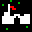 | Town | (0, 6) | `TILE_TOWN` | Town entrance — walkable |
|  | Chest | (0, 9) | `TILE_CHEST` | Treasure chest — walkable |

**Town interior tile assignments** (from `_town_tile_map` in `renderer.py`):

| Preview | Tile | Sheet Position | Constant | Usage |
|---------|------|---------------|----------|-------|
|  | Floor | (0, 1) | `TILE_FLOOR` | Interior floor — walkable |
| 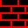 | Wall | (0, 8) | `TILE_WALL` | Interior wall — non-walkable |
|  | Chest | (0, 9) | `TILE_CHEST` | Shop chest — walkable |
|  | Exit | (0, 6) | `TILE_EXIT` | Town exit point — walkable |

**Dungeon tiles** are rendered procedurally with colored rectangles rather than sprite sheet tiles. The tile types (`TILE_DFLOOR`, `TILE_DWALL`, `TILE_STAIRS`, etc.) use fallback colors defined in `settings.py`.

---

## 2. Character Sprites — Amiga

Larger sprites (~28–34px) from the original Amiga version of Ultima III. Used as the primary sprites for these five classes. Located in `example_graphics/` (referenced by `character_tiles.json`).

| Preview | File | Class |
|---------|------|-------|
|  | `Ultima3_AMI_sprite_fighter.png` | Fighter |
|  | `Ultima3_AMI_sprite_cleric.png` | Cleric |
|  | `Ultima3_AMI_sprite_wizard-alcmt-ilsnt.png` | Wizard |
|  | `Ultima3_AMI_sprite_thief.png` | Thief |
| 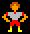 | `Ultima3_AMI_sprite_barbarian.png` | Barbarian |

These same files are also available in `src/assets/` for the renderer:

| Preview | File | Class |
|---------|------|-------|
| 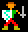 | `Ultima3_AMI_sprite_fighter.png` | Fighter |
| 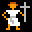 | `Ultima3_AMI_sprite_cleric.png` | Cleric |
| 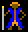 | `Ultima3_AMI_sprite_wizard-alcmt-ilsnt.png` | Wizard / Alchemist / Illusionist |
| 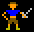 | `Ultima3_AMI_sprite_thief.png` | Thief |
|  | `Ultima3_AMI_sprite_barbarian.png` | Barbarian |

---

## 3. Character Sprites — U4 Style

16×16 pixel tiles from the Ultima IV tileset, used as fallback class sprites and for character creation. Located in `src/assets/u4_tiles/`. Black pixels are made transparent at load time.

**Class sprites** (mapped in `renderer.py`):

| Preview | File | Class |
|---------|------|-------|
| 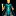 | `healer_alt_f1.png` | Alchemist |
| 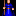 | `mage.png` | Illusionist / Mage |
|  | `druid.png` | Druid |
| 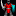 | `paladin.png` | Paladin |
| 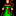 | `ranger.png` | Ranger |
|  | `bard.png` | Lark / Bard |

**Additional character creation tiles** (from `character_tiles.json`):

| Preview | File | Name |
|---------|------|------|
| 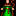 | `ranger_alt.png` | Ranger Alt |
| 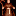 | `monk.png` | Monk |
|  | `tinker.png` | Tinker |
|  | `shepherd.png` | Shepherd |
|  | `avatar_f1.png` | Avatar |
| 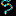 | `knight_f1.png` | Knight |
| 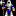 | `guard_f1.png` | Guard |
|  | `healer_f1.png` | Healer |
|  | `jester_f1.png` | Jester |
| 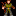 | `villager_male.png` | Villager |
| 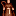 | `villager_female.png` | Villager F |
|  | `child_f1.png` | Child |
| 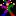 | `beggar_f1.png` | Beggar |
|  | `citizen_f1.png` | Citizen |
|  | `guard_npc.png` | Guard Alt |

---

## 4. Character Sprites — VGA (Steele)

Higher-detail VGA sprites by Joshua Steele. Used for NPCs, character creation, and villager assignments. Located in `src/assets/steele_tiles/`.

| Preview | File | Name | Usage |
|---------|------|------|-------|
|  | `vga_avatar_f1.png` | VGA Avatar | Character creation |
| 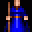 | `vga_mage_f1.png` | VGA Mage | Character creation |
| 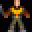 | `vga_bard_f1.png` | VGA Bard | Innkeeper NPC, character creation |
|  | `vga_fighter_f1.png` | VGA Fighter | Character creation |
| 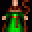 | `vga_druid_f1.png` | VGA Druid | Character creation |
| 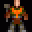 | `vga_tinker_f1.png` | VGA Tinker | Shopkeeper NPC, character creation |
| 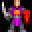 | `vga_paladin_f1.png` | VGA Paladin | Character creation |
|  | `vga_ranger_f1.png` | VGA Ranger | Character creation |
|  | `vga_shepherd_f1.png` | VGA Shepherd | Villager pool, character creation |
|  | `vga_guard_f1.png` | VGA Guard | Villager pool, character creation |
| 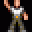 | `vga_citizen_f1.png` | VGA Citizen | Villager pool, character creation |
| 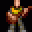 | `vga_singing_bard_f1.png` | VGA Singing Bard | Villager pool, character creation |
|  | `vga_jester_f1.png` | VGA Jester | Character creation |
|  | `vga_beggar_f1.png` | VGA Beggar | Villager pool, character creation |
|  | `vga_child_f1.png` | VGA Child | Villager pool, character creation |
|  | `vga_lord_f1.png` | VGA Lord | Elder NPC, character creation |
| 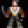 | `vga_rogue_f1.png` | VGA Rogue | Character creation |
| 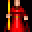 | `vga_evil_mage_f1.png` | VGA Evil Mage | Character creation |

---

## 5. Monster Sprites

Monster tiles loaded from `data/monsters.json`. Each monster has a `"tile"` field pointing to a file in `src/assets/`. Displayed in combat arenas at 32×32.

| Preview | File | Monster(s) |
|---------|------|-----------|
|  | `giant_rat_f1.png` | Giant Rat |
| 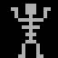 | `skeleton_f1.png` | Skeleton, Skeleton Archer |
| 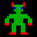 | `orc_f1.png` | Orc, Orc Shaman |
|  | `goblin_f1.png` | Goblin |
| 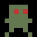 | `zombie_f1.png` | Zombie |
|  | `wolf_f1.png` | Wolf |
| 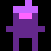 | `dark_mage_f1.png` | Dark Mage |
| 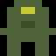 | `troll_f1.png` | Troll |

---

## 6. NPC Sprites

NPCs in towns use VGA Steele sprites assigned by role. The renderer maps NPC types to specific sprites.

| Preview | File | NPC Role | Color Code |
|---------|------|----------|------------|
|  | `vga_tinker_f1.png` | Shopkeeper | Gold (200, 160, 60) |
|  | `vga_bard_f1.png` | Innkeeper | Blue (60, 160, 200) |
|  | `vga_lord_f1.png` | Elder | Purple (180, 80, 200) |

**Villager pool** — randomly assigned via `hash(npc.name) % 6`:

| Preview | File |
|---------|------|
|  | `vga_citizen_f1.png` |
|  | `vga_shepherd_f1.png` |
|  | `vga_singing_bard_f1.png` |
|  | `vga_guard_f1.png` |
|  | `vga_beggar_f1.png` |
|  | `vga_child_f1.png` |

**Additional NPC sprites** (from `character_tiles.json`):

| Preview | File | Name |
|---------|------|------|
| 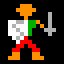 | `npc_townsfolk.png` | Townsfolk |
|  | `lark_f1.png` | Lark Alt |
|  | `pirate_brigand_f1.png` | Brigand |

---

## 7. Overworld Special Tiles

Unique overworld locations defined in `data/unique_tiles.json`. These sprites overlay the base terrain tile when a special location is present. Loaded via `_get_unique_tile_sprite()` in the renderer.

| Preview | File | Unique Tile | Description |
|---------|------|-------------|-------------|
|  | `moongate_active.png` | Moongate, Seal of Binding | Active teleportation portal |
| 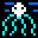 | `moongate_portal.png` | Dormant Moongate | Inactive portal stones |
| 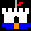 | `castle.png` | Ruined Tower | Landmark structure |
| 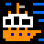 | `pirate_ship.png` | Sunken Shipwreck | Coastal point of interest |
| 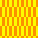 | `lava_fire_field.png` | Lava Vent | Hazardous terrain |
|  | `dungeon_entrance.png` | Smuggler's Tunnel | Hidden passage |
| 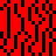 | `poison_flames.png` | Poison Swamp | Toxic hazard |
| 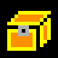 | `treasure_chest.png` | Hidden Treasure Hoard | Discoverable loot |

---

## 8. Item & Object Sprites

Special object tiles used for interactive elements in towns and dungeons.

| Preview | File | Usage |
|---------|------|-------|
|  | `chest_tile.png` | Treasure chest (towns & dungeons) |
|  | `town_gate.png` | Town entrance gate |

---

## 9. Environment & Terrain Sprites

These tiles from the U3TilesE.gif tile sheet serve as the base terrain for overworld and town rendering. The full sheet provides 80 tiles; rows 1–4 contain additional terrain variants, decorative tiles, and structures available for future use. See [Section 1](#1-tile-sheet-overworld--town) for the currently assigned positions.

---

## 10. Unassigned Graphics

The following 308 image files exist in the assets directories but are **not currently referenced** by any code or JSON configuration. They are available for use in new monsters, characters, animations, terrain, or reskins.

### Custom Sprites (`src/assets/`)

| Preview | File | Likely Purpose |
|---------|------|----------------|
| 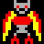 | `balron_demon_f1.png` | Monster — demon (frame 1) |
| 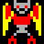 | `balron_demon_f2.png` | Monster — demon (frame 2) |
| 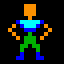 | `barbarian_f1.png` | Character — barbarian alt (frame 1) |
| 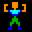 | `barbarian_f2.png` | Character — barbarian alt (frame 2) |
| 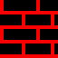 | `brick_wall.png` | Environment — brick wall |
| 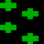 | `brush_scrubland.png` | Environment — scrubland terrain |
|  | `cleric_f1.png` | Character — cleric alt (frame 1) |
| 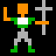 | `cleric_f2.png` | Character — cleric alt (frame 2) |
|  | `cursor_sparkle.png` | UI — cursor effect |
|  | `daemon_f1.png` | Monster — daemon (frame 1) |
| 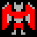 | `daemon_f2.png` | Monster — daemon (frame 2) |
|  | `dragon_f1.png` | Monster — dragon (frame 1) |
|  | `dragon_f2.png` | Monster — dragon (frame 2) |
| 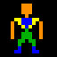 | `fighter_f1.png` | Character — fighter alt (frame 1) |
| 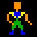 | `fighter_f2.png` | Character — fighter alt (frame 2) |
| 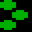 | `forest.png` | Environment — forest terrain |
|  | `grass_plains.png` | Environment — grass terrain |
|  | `horse.png` | Mount / vehicle |
|  | `illusionist_f1.png` | Character — illusionist (frame 1) |
|  | `illusionist_f2.png` | Character — illusionist (frame 2) |
|  | `island_jungle.png` | Environment — jungle terrain |
|  | `lark_f2.png` | Character — lark (frame 2) |
|  | `man_thing_f1.png` | Monster — man-thing (frame 1) |
|  | `man_thing_f2.png` | Monster — man-thing (frame 2) |
|  | `mountains.png` | Environment — mountain terrain |
|  | `night_sky_stars.png` | Environment — night sky background |
|  | `orc_f2.png` | Monster — orc (frame 2) |
|  | `paladin_f1.png` | Character — paladin alt (frame 1) |
|  | `paladin_f2.png` | Character — paladin alt (frame 2) |
|  | `pirate_brigand_f2.png` | Character — brigand (frame 2) |
|  | `ship_frigate.png` | Vehicle — frigate ship |
|  | `shrine_church.png` | Environment — church/shrine |
|  | `skeleton_f2.png` | Monster — skeleton (frame 2) |
|  | `spritesheet.png` | Sprite sheet — misc |
|  | `thief_f1.png` | Character — thief alt (frame 1) |
|  | `thief_f2.png` | Character — thief alt (frame 2) |
|  | `town_village.png` | Environment — town/village |
|  | `void_empty.png` | Environment — void/empty space |
|  | `water_deep_ocean.png` | Environment — deep water |
|  | `whirlpool.png` | Environment — whirlpool (frame 1) |
|  | `whirlpool_f2.png` | Environment — whirlpool (frame 2) |
|  | `wizard_f1.png` | Character — wizard alt (frame 1) |
|  | `wizard_f2.png` | Character — wizard alt (frame 2) |

### VGA Steele Alt Frames (`src/assets/steele_tiles/`)

Animation frames and alternate sprites not currently assigned to any NPC or character.

| Preview | File | Likely Purpose |
|---------|------|----------------|
|  | `vga_bard_f2.png` | Bard animation frame 2 |
|  | `vga_beggar_f2.png` | Beggar animation frame 2 |
|  | `vga_bull_f1.png` | Bull monster frame 1 |
|  | `vga_bull_f2.png` | Bull monster frame 2 |
|  | `vga_child_f2.png` | Child animation frame 2 |
|  | `vga_citizen_f2.png` | Citizen animation frame 2 |
|  | `vga_druid_f2.png` | Druid animation frame 2 |
|  | `vga_evil_mage_f2.png` | Evil Mage frame 2 |
|  | `vga_evil_mage_f3.png` | Evil Mage frame 3 |
|  | `vga_evil_mage_f4.png` | Evil Mage frame 4 |
|  | `vga_fighter_f2.png` | Fighter animation frame 2 |
|  | `vga_guard_f2.png` | Guard animation frame 2 |
|  | `vga_jester_f2.png` | Jester animation frame 2 |
|  | `vga_lich_f1.png` | Lich monster frame 1 |
|  | `vga_lich_f2.png` | Lich monster frame 2 |
|  | `vga_lich_f3.png` | Lich monster frame 3 |
|  | `vga_lich_f4.png` | Lich monster frame 4 |
|  | `vga_lord_f2.png` | Lord animation frame 2 |
|  | `vga_mage_f2.png` | Mage animation frame 2 |
|  | `vga_paladin_f2.png` | Paladin animation frame 2 |
|  | `vga_ranger_f2.png` | Ranger animation frame 2 |
|  | `vga_rogue_f2.png` | Rogue frame 2 |
|  | `vga_rogue_f3.png` | Rogue frame 3 |
|  | `vga_rogue_f4.png` | Rogue frame 4 |
|  | `vga_singing_bard_f2.png` | Singing Bard frame 2 |
|  | `vga_skeleton_f1.png` | Skeleton frame 1 |
|  | `vga_skeleton_f2.png` | Skeleton frame 2 |
|  | `vga_skeleton_f3.png` | Skeleton frame 3 |
|  | `vga_skeleton_f4.png` | Skeleton frame 4 |
|  | `vga_tinker_f2.png` | Tinker animation frame 2 |

### U4 Tile Library (`src/assets/u4_tiles/`)

Large library of Ultima IV–style tiles available for terrain, monsters, structures, and effects.

#### Monsters & Creatures

| Preview | File | Description |
|---------|------|-------------|
|  | `balron_f1.png` | Balron frame 1 |
|  | `balron_f2.png` | Balron frame 2 |
|  | `balron_f3.png` | Balron frame 3 |
|  | `balron_f4.png` | Balron frame 4 |
|  | `bat_f1.png` | Bat frame 1 |
|  | `bat_f2.png` | Bat frame 2 |
|  | `bear_f1.png` | Bear frame 1 |
|  | `bear_f2.png` | Bear frame 2 |
|  | `cyclops_f1.png` | Cyclops frame 1 |
|  | `cyclops_f2.png` | Cyclops frame 2 |
|  | `cyclops_f3.png` | Cyclops frame 3 |
|  | `cyclops_f4.png` | Cyclops frame 4 |
|  | `daemon_f1.png` | Daemon frame 1 |
|  | `daemon_f2.png` | Daemon frame 2 |
|  | `daemon_f3.png` | Daemon frame 3 |
|  | `daemon_f4.png` | Daemon frame 4 |
|  | `dark_swarm_f1.png` | Dark Swarm frame 1 |
|  | `dark_swarm_f2.png` | Dark Swarm frame 2 |
|  | `dark_swarm_f3.png` | Dark Swarm frame 3 |
|  | `dark_swarm_f4.png` | Dark Swarm frame 4 |
|  | `dragon_red_f1.png` | Red Dragon frame 1 |
|  | `dragon_red_f2.png` | Red Dragon frame 2 |
|  | `dragon_red_f3.png` | Red Dragon frame 3 |
|  | `dragon_red_f4.png` | Red Dragon frame 4 |
|  | `drake_f1.png` | Drake frame 1 |
|  | `drake_f2.png` | Drake frame 2 |
|  | `drake_f3.png` | Drake frame 3 |
|  | `drake_f4.png` | Drake frame 4 |
|  | `ettin_f1.png` | Ettin frame 1 |
|  | `ettin_f2.png` | Ettin frame 2 |
|  | `ettin_f3.png` | Ettin frame 3 |
|  | `ettin_f4.png` | Ettin frame 4 |
|  | `gazer_f1.png` | Gazer frame 1 |
|  | `gazer_f2.png` | Gazer frame 2 |
|  | `gazer_f3.png` | Gazer frame 3 |
|  | `gazer_f4.png` | Gazer frame 4 |
|  | `ghost_f1.png` | Ghost frame 1 |
|  | `ghost_f2.png` | Ghost frame 2 |
|  | `ghost_f3.png` | Ghost frame 3 |
|  | `ghost_f4.png` | Ghost frame 4 |
|  | `ghost_f5.png` | Ghost frame 5 |
|  | `ghost_f6.png` | Ghost frame 6 |
|  | `gremlin_f1.png` | Gremlin frame 1 |
|  | `gremlin_f2.png` | Gremlin frame 2 |
|  | `gremlin_f3.png` | Gremlin frame 3 |
|  | `gremlin_f4.png` | Gremlin frame 4 |
|  | `hydra_f1.png` | Hydra frame 1 |
|  | `hydra_f2.png` | Hydra frame 2 |
|  | `hydra_f3.png` | Hydra frame 3 |
|  | `hydra_f4.png` | Hydra frame 4 |
|  | `insectoid_f1.png` | Insectoid frame 1 |
|  | `insectoid_f2.png` | Insectoid frame 2 |
|  | `insectoid_f3.png` | Insectoid frame 3 |
|  | `insectoid_f4.png` | Insectoid frame 4 |
|  | `lich_f1.png` | Lich frame 1 |
|  | `lich_f2.png` | Lich frame 2 |
|  | `lich_f3.png` | Lich frame 3 |
|  | `lich_f4.png` | Lich frame 4 |
|  | `lizardman_f1.png` | Lizardman frame 1 |
|  | `lizardman_f2.png` | Lizardman frame 2 |
|  | `lizardman_f3.png` | Lizardman frame 3 |
|  | `lizardman_f4.png` | Lizardman frame 4 |
|  | `nixie_f1.png` | Nixie frame 1 |
|  | `nixie_f2.png` | Nixie frame 2 |
|  | `orc_dark.png` | Dark Orc |
|  | `orc_f1.png` | Orc frame 1 |
|  | `orc_f2.png` | Orc frame 2 |
|  | `orc_f3.png` | Orc frame 3 |
|  | `orc_f4.png` | Orc frame 4 |
|  | `orc_green.png` | Green Orc |
|  | `phantom_f1.png` | Phantom frame 1 |
|  | `phantom_f2.png` | Phantom frame 2 |
|  | `phantom_f3.png` | Phantom frame 3 |
|  | `phantom_f4.png` | Phantom frame 4 |
|  | `rat_f1.png` | Rat frame 1 |
|  | `rat_f2.png` | Rat frame 2 |
|  | `rat_f3.png` | Rat frame 3 |
|  | `rat_f4.png` | Rat frame 4 |
|  | `reaper_f1.png` | Reaper frame 1 |
|  | `reaper_f2.png` | Reaper frame 2 |
|  | `reaper_f3.png` | Reaper frame 3 |
|  | `reaper_f4.png` | Reaper frame 4 |
|  | `sea_horse_f1.png` | Sea Horse frame 1 |
|  | `sea_horse_f2.png` | Sea Horse frame 2 |
|  | `sea_horse_f3.png` | Sea Horse frame 3 |
|  | `sea_horse_f4.png` | Sea Horse frame 4 |
|  | `sea_serpent_f1.png` | Sea Serpent frame 1 |
|  | `sea_serpent_f2.png` | Sea Serpent frame 2 |
|  | `sea_serpent_f3.png` | Sea Serpent frame 3 |
|  | `skeleton_f1.png` | Skeleton frame 1 |
|  | `skeleton_f2.png` | Skeleton frame 2 |
|  | `skeleton_f3.png` | Skeleton frame 3 |
|  | `skeleton_f4.png` | Skeleton frame 4 |
|  | `slime_f1.png` | Slime frame 1 |
|  | `slime_f2.png` | Slime frame 2 |
|  | `slime_f3.png` | Slime frame 3 |
|  | `slime_f4.png` | Slime frame 4 |
|  | `snake_f1.png` | Snake frame 1 |
|  | `snake_f2.png` | Snake frame 2 |
|  | `snake_f3.png` | Snake frame 3 |
|  | `snake_f4.png` | Snake frame 4 |
|  | `spider_f1.png` | Spider frame 1 |
|  | `spider_f2.png` | Spider frame 2 |
|  | `spider_f3.png` | Spider frame 3 |
|  | `spider_f4.png` | Spider frame 4 |
|  | `troll_brute_f1.png` | Troll Brute frame 1 |
|  | `troll_brute_f2.png` | Troll Brute frame 2 |
|  | `troll_brute_f3.png` | Troll Brute frame 3 |
|  | `troll_brute_f4.png` | Troll Brute frame 4 |
|  | `troll_f1.png` | Troll frame 1 |
|  | `troll_f2.png` | Troll frame 2 |
|  | `troll_f3.png` | Troll frame 3 |
|  | `troll_f4.png` | Troll frame 4 |
|  | `wisp_f1.png` | Wisp frame 1 |
|  | `wisp_f2.png` | Wisp frame 2 |
|  | `zorn_f1.png` | Zorn frame 1 |
|  | `zorn_f2.png` | Zorn frame 2 |
|  | `zorn_f3.png` | Zorn frame 3 |
|  | `zorn_f4.png` | Zorn frame 4 |

#### Characters & NPCs (Alt Frames)

| Preview | File | Description |
|---------|------|-------------|
|  | `avatar_f2.png` | Avatar frame 2 |
|  | `beggar_f2.png` | Beggar frame 2 |
|  | `child_f2.png` | Child frame 2 |
|  | `citizen_f2.png` | Citizen frame 2 |
|  | `fighter.png` | Fighter static |
|  | `guard_f2.png` | Guard frame 2 |
|  | `healer_alt_f2.png` | Healer alt frame 2 |
|  | `healer_f2.png` | Healer frame 2 |
|  | `jester_f2.png` | Jester frame 2 |
|  | `knight_f2.png` | Knight frame 2 |

#### Terrain & Environment

| Preview | File | Description |
|---------|------|-------------|
|  | `bridge.png` | Bridge |
|  | `brush.png` | Brush / scrubland |
|  | `campfire.png` | Campfire |
|  | `castle.png` | Castle structure |
|  | `castle_wall_left.png` | Castle wall (left) |
|  | `castle_wall_mid.png` | Castle wall (middle) |
|  | `castle_wall_right.png` | Castle wall (right) |
|  | `deep_water.png` | Deep water |
|  | `darkness.png` | Darkness / fog of war |
|  | `dungeon_dark.png` | Dungeon darkness |
|  | `dungeon_entrance.png` | Dungeon entrance |
|  | `forest.png` | Forest |
|  | `grassland.png` | Grassland |
|  | `hills.png` | Hills |
|  | `lava_red.png` | Lava |
|  | `medium_water.png` | Medium water |
|  | `mountains.png` | Mountains |
|  | `shallow_water.png` | Shallow water |
|  | `swamp.png` | Swamp |
|  | `town_small.png` | Small town |
|  | `village.png` | Village |
|  | `water_anim_1.png` | Water animation frame 1 |
|  | `water_anim_2.png` | Water animation frame 2 |

#### Structures & Objects

| Preview | File | Description |
|---------|------|-------------|
|  | `altar_left.png` | Altar (left half) |
|  | `altar_right.png` | Altar (right half) |
|  | `ankh.png` | Ankh symbol |
|  | `ankh_blue_f1.png` | Blue ankh frame 1 |
|  | `ankh_blue_f2.png` | Blue ankh frame 2 |
|  | `ankh_blue_f3.png` | Blue ankh frame 3 |
|  | `ankh_blue_f4.png` | Blue ankh frame 4 |
|  | `balloon.png` | Hot air balloon |
|  | `brick_blank_1.png` | Blank brick tile 1 |
|  | `brick_blank_2.png` | Blank brick tile 2 |
|  | `brick_blank_3.png` | Blank brick tile 3 |
|  | `brick_blank_4.png` | Blank brick tile 4 |
|  | `brick_floor.png` | Brick floor |
|  | `brick_wall.png` | Brick wall |
|  | `brick_wall_alt.png` | Brick wall (alternate) |
|  | `black_blank_1.png` | Black blank tile 1 |
|  | `black_blank_2.png` | Black blank tile 2 |
|  | `black_blank_3.png` | Black blank tile 3 |
|  | `chest.png` | Chest |
|  | `covered_wagon.png` | Covered wagon |
|  | `fireplace.png` | Fireplace |
|  | `horse_east.png` | Horse (facing east) |
|  | `horse_west.png` | Horse (facing west) |
|  | `locked_door.png` | Locked door |
|  | `moon_full.png` | Full moon |
|  | `pirate_ship_f1.png` | Pirate ship frame 1 |
|  | `pirate_ship_f2.png` | Pirate ship frame 2 |
|  | `pirate_ship_f3.png` | Pirate ship frame 3 |
|  | `pirate_ship_f4.png` | Pirate ship frame 4 |
|  | `portcullis.png` | Portcullis gate |
|  | `rock_pile.png` | Rock pile |
|  | `ship_east.png` | Ship facing east |
|  | `ship_north.png` | Ship facing north |
|  | `ship_south.png` | Ship facing south |
|  | `ship_west.png` | Ship facing west |
|  | `skeleton_decor.png` | Decorative skeleton |
|  | `stone_wall.png` | Stone wall |
|  | `torch_post.png` | Torch post |
|  | `whirlpool_f1.png` | Whirlpool frame 1 |
|  | `whirlpool_f2.png` | Whirlpool frame 2 |

#### Magic & Effects

| Preview | File | Description |
|---------|------|-------------|
|  | `energy_field_p1.png` | Energy field phase 1 |
|  | `energy_field_p2.png` | Energy field phase 2 |
|  | `explosion_alt.png` | Explosion (alternate) |
|  | `explosion_red.png` | Explosion (red) |
|  | `fire_field_mag.png` | Magic fire field |
|  | `fire_field_red.png` | Red fire field |
|  | `magic_orb_blue.png` | Blue magic orb |
|  | `magic_orb_red.png` | Red magic orb |
|  | `magical_barrier.png` | Magical barrier |
|  | `poison_field.png` | Poison field |
|  | `portal_closed.png` | Portal (closed) |
|  | `portal_open.png` | Portal (open) |
|  | `sparkle.png` | Sparkle effect |
|  | `tornado.png` | Tornado |

#### Text Tiles

| Preview | File | Description |
|---------|------|-------------|
|  | `letter_a.png` | Letter A |
|  | `letter_b.png` | Letter B |
|  | `letter_c.png` | Letter C |
|  | `letter_d.png` | Letter D |
|  | `letter_e.png` | Letter E |
|  | `letter_f.png` | Letter F |
|  | `letter_g.png` | Letter G |
|  | `letter_h.png` | Letter H |
|  | `letter_i.png` | Letter I |
|  | `letter_j.png` | Letter J |
|  | `letter_k.png` | Letter K |
|  | `letter_l.png` | Letter L |
|  | `letter_m.png` | Letter M |
|  | `letter_n.png` | Letter N |
|  | `letter_o.png` | Letter O |
|  | `letter_p.png` | Letter P |
|  | `letter_q.png` | Letter Q |
|  | `letter_r.png` | Letter R |
|  | `letter_s.png` | Letter S |
|  | `letter_t.png` | Letter T |
|  | `letter_u.png` | Letter U |
|  | `letter_v.png` | Letter V |
|  | `letter_w.png` | Letter W |
|  | `letter_x.png` | Letter X |
|  | `letter_y.png` | Letter Y |
|  | `letter_z.png` | Letter Z |
|  | `scroll_text_1.png` | Scroll text 1 |
|  | `scroll_text_2.png` | Scroll text 2 |
|  | `scroll_text_3.png` | Scroll text 3 |

---

## Summary

| Category | In Use | Available (Unassigned) |
|----------|--------|----------------------|
| Tile sheet (U3TilesE.gif) | 8 overworld + 4 town positions | ~68 remaining sheet positions |
| Amiga character sprites | 5 | 0 |
| U4 character/class sprites | 21 | 10 alt frames |
| VGA Steele sprites | 18 | 30 alt frames + creatures |
| Monster sprites | 8 unique (10 assignments) | 100+ creature tiles in U4 library |
| Unique overworld tiles | 8 | — |
| Special objects | 2 | — |
| Custom root sprites | 6 | 43 |
| **Total** | **66 files** | **308 files** |
