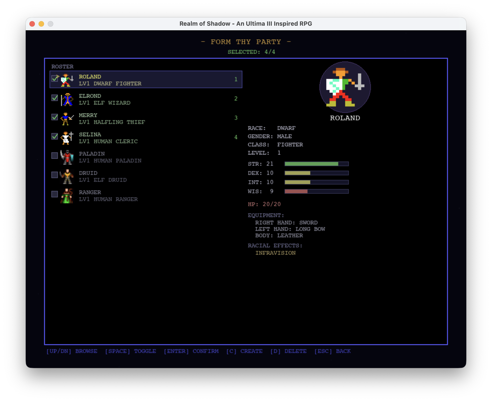
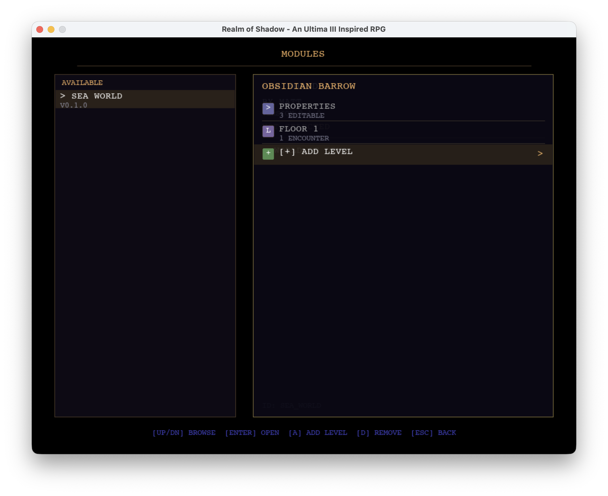
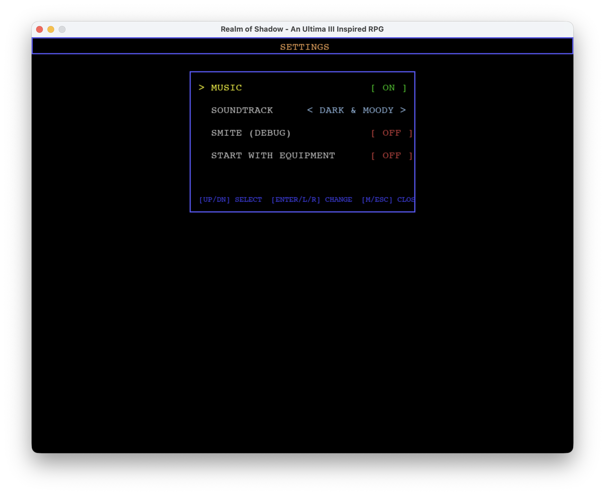
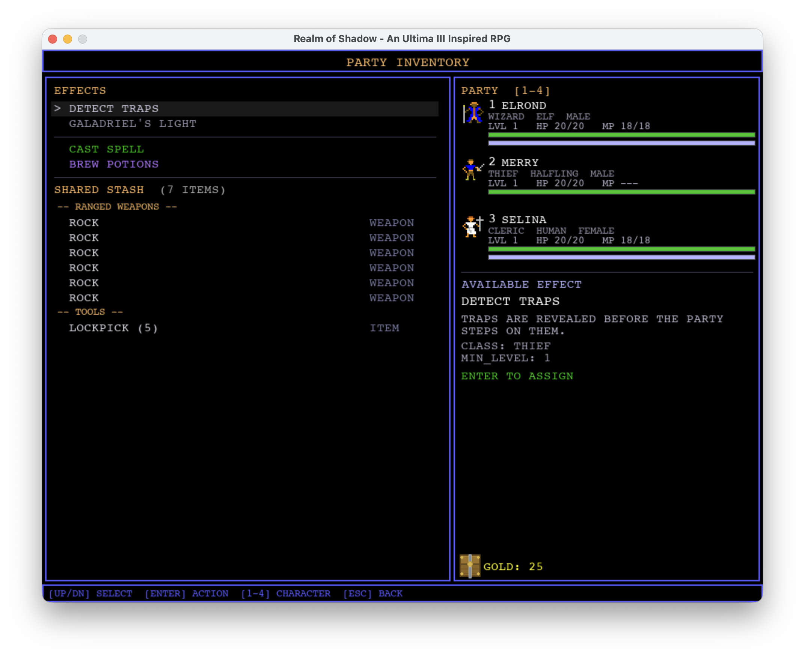
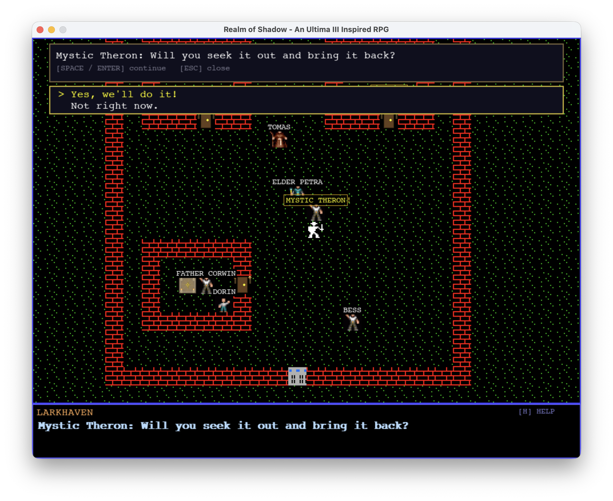
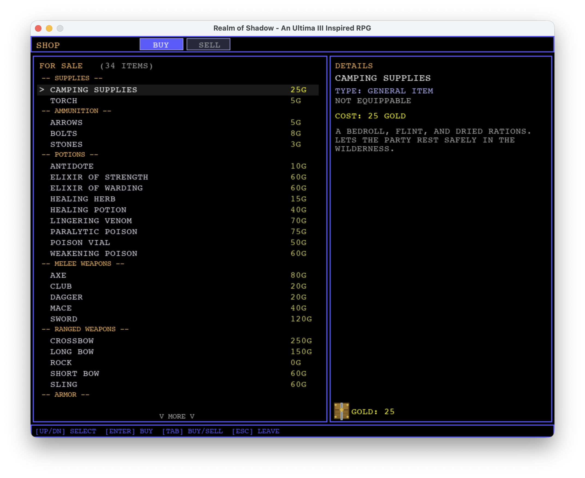
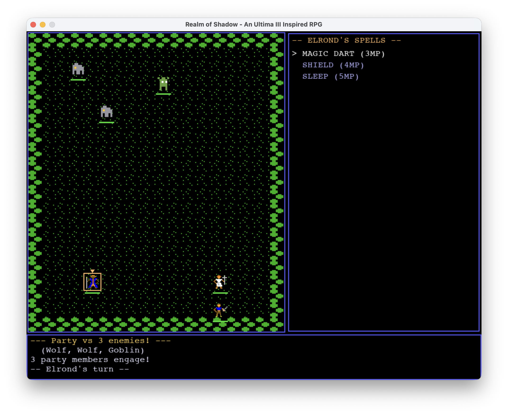
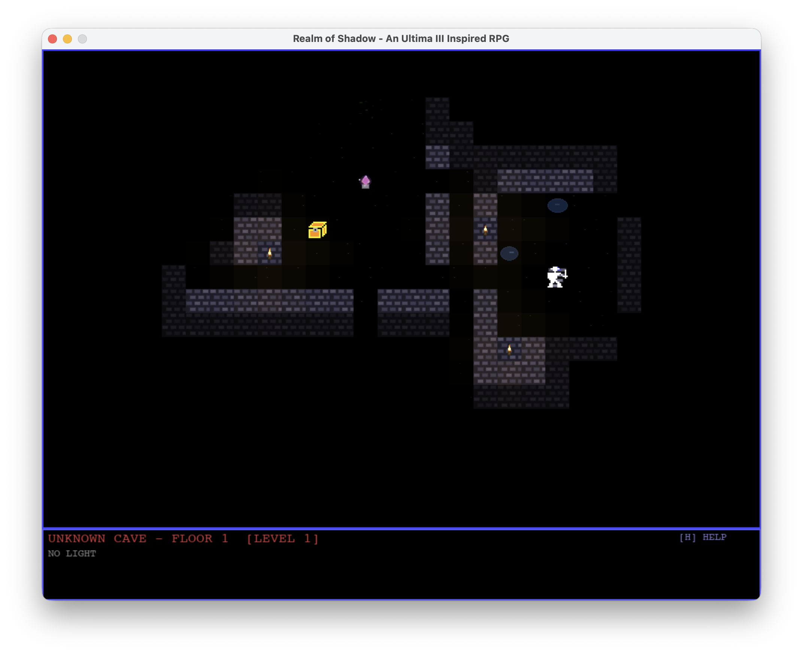

# Realm of Shadow — Visual Tour (v0.2.0)

A tour through the game as of the v0.2.0 build, March 2026.

---

### Title Screen

The main menu, styled after classic RPG title screens. From here you can start a new game, form your party, manage save files, browse and edit adventure modules, or adjust settings. The currently loaded module is displayed at the bottom.

---

### Party Creation

The "Form Thy Party" screen where you build your group of up to four adventurers. Each character has a race, class, gender, and four core attributes (STR, DEX, INT, WIS). The right panel shows a sprite preview and full stat breakdown for the selected character, including equipment and racial effects like the Dwarf's Infravision.

---

### Module Editor

The built-in module editor lets you create and customize adventure content. Here the "Sea World" module is selected, showing the dungeon "Obsidian Barrow" with its editable properties, floor layout, and encounter configuration. Dungeon floors can be added, removed, and individually tuned.

---

### Settings

The settings screen with options for music, soundtrack style, the debug Smite mode (which adds a one-hit-kill option to combat for testing), and whether new characters start with equipment or begin with only basic gear.

---

### Overworld

Exploring the procedurally generated overworld. The party (center) traverses a landscape of grass, forests, mountains, paths, and water. Towns and dungeon entrances are visible on the map. The status bar at the bottom shows the current date, time of day, and terrain type.

---

### Party Inventory

The inventory screen showing the party's shared stash of weapons, tools, and supplies. The right panel lists all party members with their HP/MP bars, and displays details for the currently highlighted item — here, the Thief's Detect Traps ability. Class abilities, spells, and potion brewing are also accessible from this screen.

---

### Town — Quest Giver

Inside the town of Larkhaven, the party speaks with Mystic Theron, a quest giver NPC. He's offering a retrieval quest with a yes/no dialogue choice. Other named NPCs are visible around town including Elder Petra, Father Corwin, and various townsfolk. The red brick buildings and green floor tiles give each town a distinct look.

---

### Shop

The shopkeeper's buy screen showing the full inventory of purchasable goods — supplies, ammunition, potions, melee weapons, ranged weapons, and armor — with prices in gold. The right panel shows item details and the party's current gold. You can switch between buying and selling with the tab key.

---

### Combat

Tactical grid combat against a group of wolves and a goblin. The Wizard Elrond is selecting from available spells (Magic Dart, Shield, Sleep) on the right panel. The combat log at the bottom shows the encounter composition and whose turn it is. Party members and monsters are positioned on the tile-based arena.

---

### Dungeon

Exploring a dungeon floor with low torch density — most of the level is shrouded in darkness, with only a few rooms and corridors visible. A treasure chest glows in one room while the party navigates through the stone-walled passages. The status bar shows the dungeon name, floor number, and current light level.
