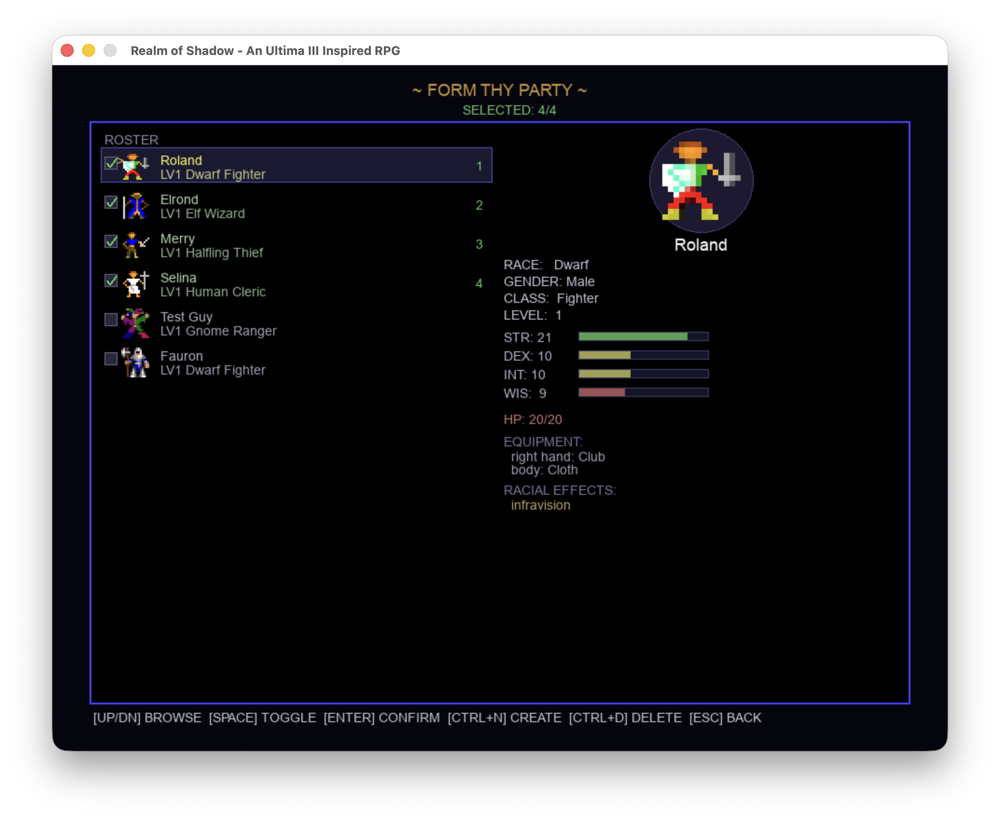
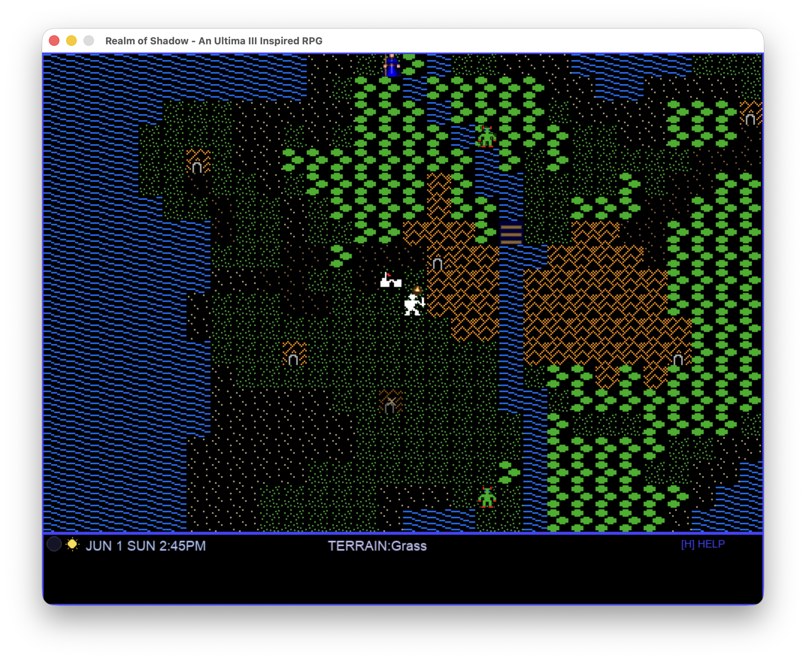
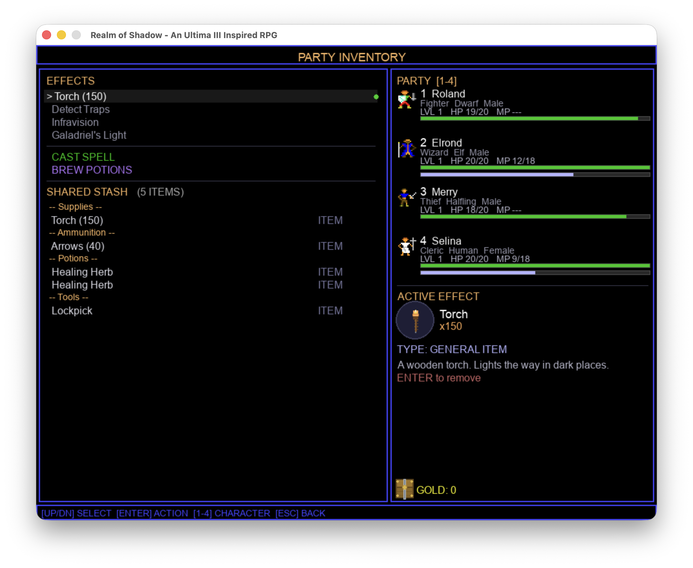
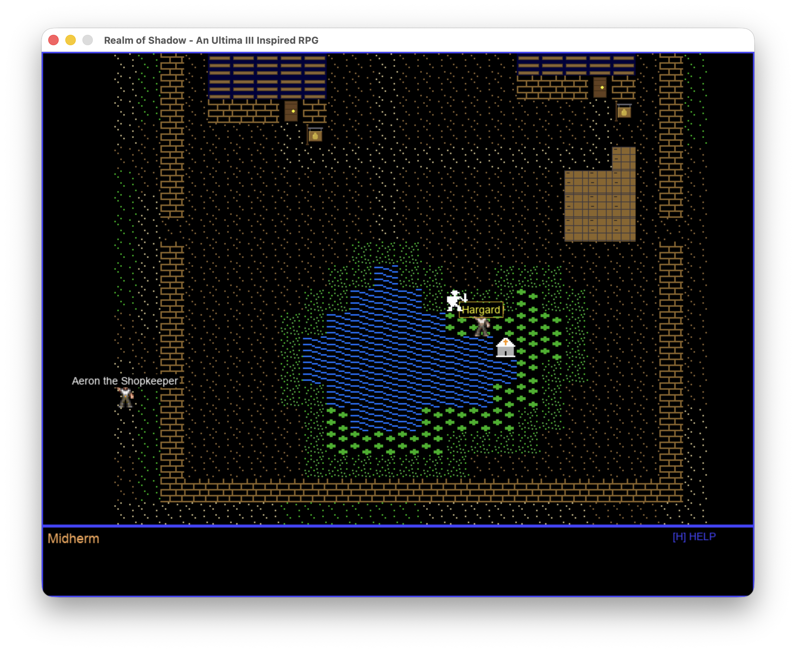
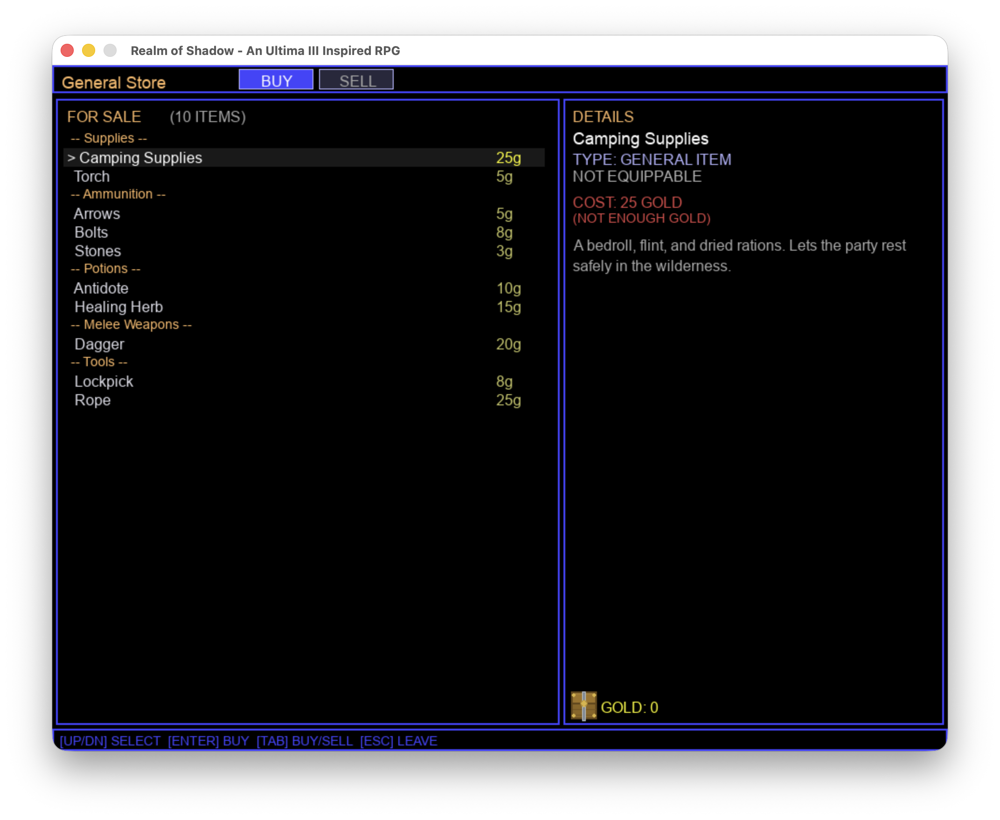
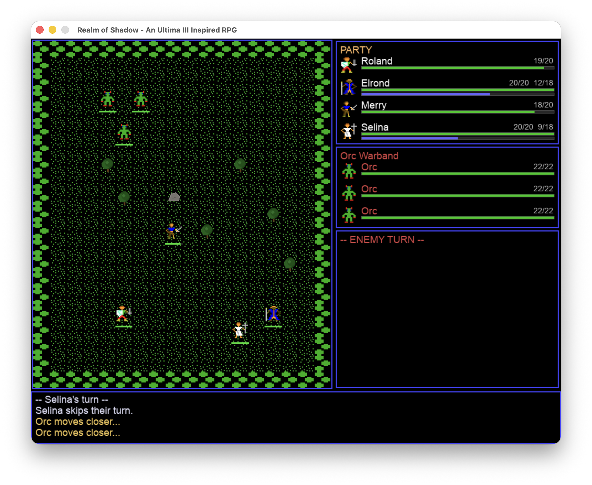
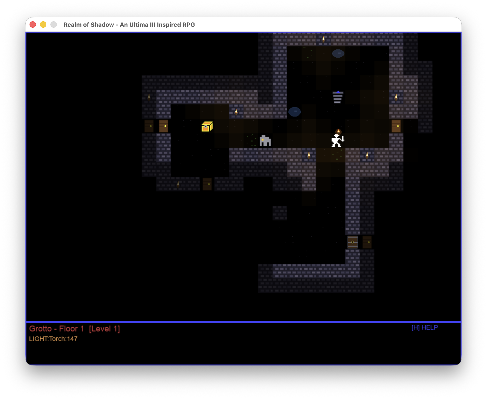

# Realm of Shadow — Visual Tour (v1.0.0)

The game has made a lot of progress since I started this project in February and since the first "release" on March 12th. I have learned an awful lot about early 1980s gaming and also how hard making games actually is, even when you are not coding everything.

At this point, I have a fully playable game that supports new module creation. It basically gives you a short D&D experience up to around level 8. There are 8 character classes that are distinct, but a lot more work needs to go into fleshing this stuff out. But, we do have enough complexity for a few hours of nostaglic fun and an extensible system. Not bad for two months work!

---

### Party Creation

The "Form Thy Party" screen where you build your group of up to four adventurers. Each character has a race, class, gender, and four core attributes (STR, DEX, INT, WIS). The right panel shows a sprite preview and full stat breakdown for the selected character, including equipment and racial effects like the Dwarf's Infravision.

---

### Overworld

Exploring the procedurally generated overworld. The party (center) traverses a landscape of grass, forests, mountains, paths, and water. Towns and dungeon entrances are visible on the map. The status bar at the bottom shows the current date, time of day, and terrain type.

---

### Party Inventory

The inventory screen showing the party's shared stash of weapons, tools, and supplies. The right panel lists all party members with their HP/MP bars, and displays details for the currently highlighted item — here, the Thief's Detect Traps ability. Class abilities, spells, and potion brewing are also accessible from this screen.

---

### Town — Quest Giver

Inside the town of Midherm, the party speaks with a quest giver NPC. Other named NPCs are visible around town. The red brick buildings and green floor tiles give each town a distinct look.

---

### Shop

The shopkeeper's buy screen showing the full inventory of purchasable goods — supplies, ammunition, potions, melee weapons, ranged weapons, and armor — with prices in gold. The right panel shows item details and the party's current gold. You can switch between buying and selling with the tab key.

---

### Combat

Tactical grid combat against a group of wolves and a goblin. The Wizard Elrond is selecting from available spells (Magic Dart, Shield, Sleep) on the right panel. The combat log at the bottom shows the encounter composition and whose turn it is. Party members and monsters are positioned on the tile-based arena.

---

### Dungeon

Exploring a dungeon floor with low torch density — most of the level is shrouded in darkness, with only a few rooms and corridors visible. A treasure chest glows in one room while the party navigates through the stone-walled passages. The status bar shows the dungeon name, floor number, and current light level.
