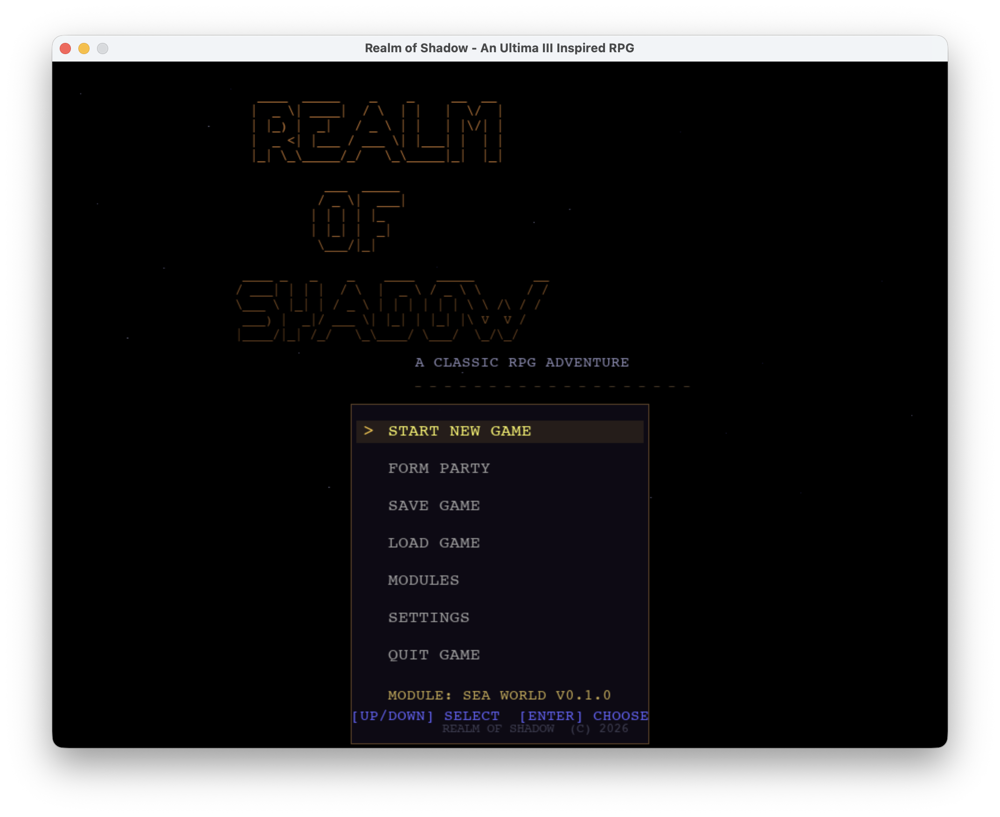
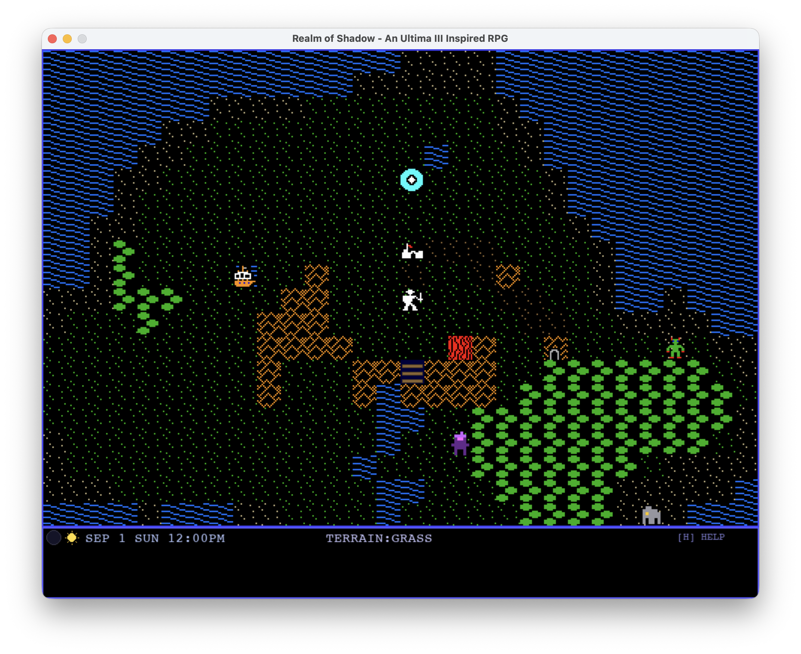

# Realm of Shadow

An Ultima III–inspired top-down, turn-based RPG built with Python and Pygame. Lead a party of four adventurers through a procedurally generated world of overworld exploration, town visits, dungeon delving, and tactical grid combat.

## Features

- Dungeons & Dragons inspired turn-based combat system
- Quest system
- Proceduraly generated dungeons and intentionally crafted adventures
- Race and class system
- 1980's style Player's Manual and Adventure Map
- Dungeon Master mode that allows players to craft their own adventures

---

<table>
<tr>
<td align="center"></td>
<td align="center"></td>
</tr>
</table>

---

## How to Install and Play Realm of Shadow

A pre-built macOS version is available on the [Releases](../../releases) page. To get started:

1. Download the `.zip` file from the latest release.
2. Unzip it — you'll get a folder called `RealmOfShadow`.
3. **Before opening the game**, you must clear the macOS quarantine flag. Open Terminal and run:
   ```
   xattr -cr ~/Downloads/RealmOfShadow/
   ```
   If you unzipped it somewhere other than Downloads, adjust the path — or drag the folder onto the Terminal window to fill it in automatically. You need to do this each time you download a new release.
4. Open the `RealmOfShadow` folder and double-click the file called **`RealmOfShadow`** (the one with no file extension) to launch the game.

> **First launch:** The game may take 10–20 seconds to appear the first time you run it while your system unpacks and caches the bundled libraries. Subsequent launches will be faster.

> **"Damaged and can't be opened" error:** If you skipped step 3 and macOS says the app is damaged, don't worry — the file isn't actually damaged. macOS shows this message for any downloaded app that isn't notarized with Apple. Run the `xattr -cr` command from step 3 and try again.

---

## How to Build Realm of Shadow in Python

If you want to run this game on Windows or Linux, or if you just want to tinker with the code you will need to clone this repository and use Python. 

### What You Need

- **Python 3.9 or newer.** Check with `python3 --version` in a terminal. If you don't have it:
  - **Mac:** `brew install python3` (if you have Homebrew) or download from [python.org](https://www.python.org/downloads/macos/)
  - **Windows:** Download from [python.org](https://www.python.org/downloads/windows/) — check "Add Python to PATH" during install
  - **Linux:** `sudo apt install python3 python3-pip` (Ubuntu/Debian) or your distro's equivalent

- **Git** (to clone the repo). Most Macs and Linux systems have it already. Windows users can get it from [git-scm.com](https://git-scm.com/).

### Setup

1. **Clone the repository:**
   ```
   git clone https://github.com/mattjcamp/game_rpg_turn_based_open_world
   cd game_rpg_turn_based_open_world
   ```

2. **Install dependencies:**
   ```
   pip3 install -r requirements.txt
   ```
   This installs Pygame (graphics/audio) and NumPy (used for procedural music generation).

3. **Run the game:**
   ```
   python3 main.py
   ```

That's it. A window should open with the title screen.

---

## Building a Standalone Executable

If you want to build the game yourself (or build for a platform not listed in Releases), you can package it into a standalone app using PyInstaller.

### Prerequisites

```
pip3 install pyinstaller
```

### Build

```
python3 build_game.py
```

This runs PyInstaller using the included `realm_of_shadow.spec` and produces a ready-to-distribute folder at `dist/RealmOfShadow/`. The build takes a minute or two. On macOS, the script automatically applies an ad-hoc code signature to reduce Gatekeeper warnings.

> **Note:** You need to build on each platform you want to support — a Mac produces a Mac build, Windows produces a Windows build, etc.

### Distribute

Zip the output folder and share it:

```
cd dist && zip -r RealmOfShadow-mac.zip RealmOfShadow/
```

Upload the zip to [itch.io](https://itch.io), attach it to a GitHub Release, or send it directly.

### Platform Notes for Recipients

**Windows** — Unzip the folder and double-click `RealmOfShadow.exe`. If Windows Defender SmartScreen shows a warning, click "More info" and then "Run anyway."

**Linux** — Unzip the folder, then in a terminal:
```
chmod +x RealmOfShadow/RealmOfShadow
./RealmOfShadow/RealmOfShadow
```
---
